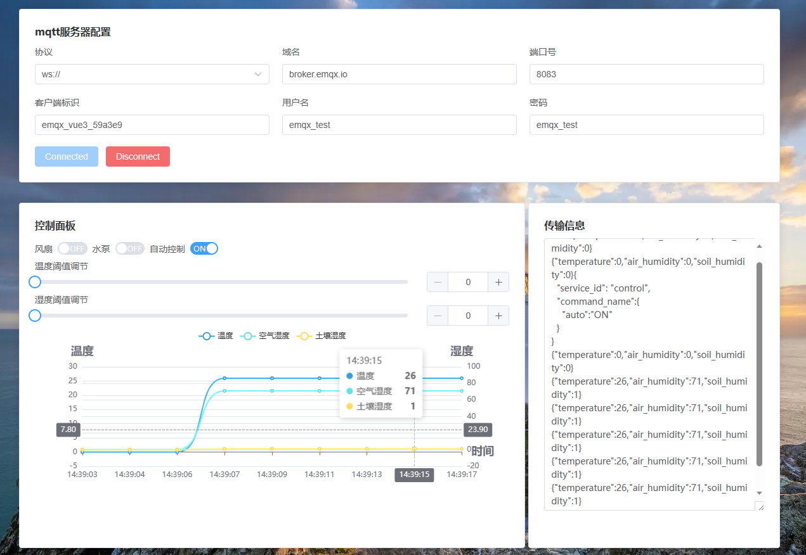

# KHDVK-3861B-hi3861

## 项目介绍

本项目是基于深开鸿智能开发套件KHDVK-3861B AIoT进行开发，分为设备端和应用端。

### 设备端环境搭建

1. 具体说明参考[联动场景：智慧农业案例源码: 使用土壤湿度检测板和温湿度感应板组合成智慧农业场景，当湿度大于湿度阈值水泵正常运转否则水泵关闭，土壤湿度感应板放入准备好的容器中，温湿度感应器自动感应空气中数据，当温度大于20℃，风扇正常运转 (gitee.com)](https://gitee.com/KHDVK-3861B/smart-agriculture)中的README.md。
2. 将项目中的MQTT文件夹放在"//khdvk-3861b-blank-project/ applications / chinasoftinc / wifi-iot / app/"下；
3. app/BUILD.gn为顶层构建脚本，其中的构建开关变量enable_MQTT在//khdvk-3861b-blank-project/vendor/chinasoftinc/hilink_3861_Agriculture/config.json中开启，在//khdvk-3861b-blank-project/build/lite/config/subsystem/applications/config.gni中配置变量声明。
4. 具体环境配置请在[深开鸿KHDVK-3861B AIoT智能开发套件: KHDVK-3861B AIoT智能开发套件是基于海思Hi3861V100芯片能力，融合周边拓展模块组成的多场景OpenHarmony系统开发套件。 (gitee.com)](https://gitee.com/KHDVK-3861B)中的README.md获取资料配置。

### 应用端环境搭建

应用端文件夹为farm_web_app，依赖环境为vue3和node.js，具体版本请看package.json。

### 效果预览

#### 登录界面

#### 注册界面

#### 运行界面

